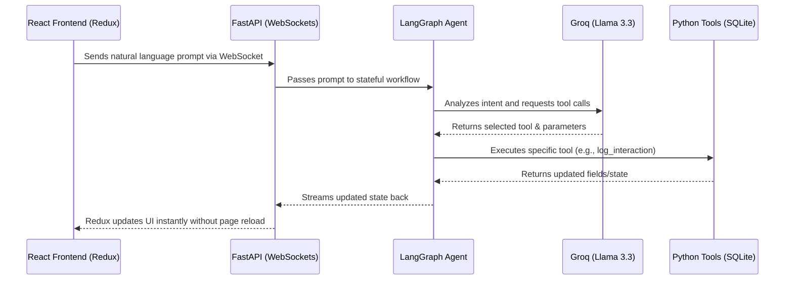

# AI-Driven CRM: HCP Interaction Module

This repository contains an AI-First Customer Relationship Management (CRM) module specifically designed for Healthcare Professionals (HCPs). It features a split-screen design where users can log HCP interactions entirely through natural language using an AI assistant, without any manual form entry.

## 🚀 Tech Stack
* **Frontend**: React, Redux Toolkit, Vite, CSS (Vanilla)
* **Backend**: Python, FastAPI, LangGraph, LangChain, SQLite
* **LLM**: Groq API (Llama 3.3 70B Versatile)
* **Testing**: Playwright (E2E Automated UI Testing)

## 📦 Project Structure
- `/frontend`: Contains the React UI and Playwright tests.
- `/backend`: Contains the FastAPI server, LangGraph agent logic, and SQLite database setup.

## 🔄 Architecture & Workflow
Here is how data flows through the application:


## 🛠️ LangGraph Tools Implemented
This project utilizes a stateful LangGraph workflow to interpret user inputs and trigger 5 distinct tools:
1. **`log_interaction`**: Extracts initial interaction data (Name, Date, Topics) and populates the CRM.
2. **`edit_interaction`**: Specifically updates a single field to correct mistakes without overwriting other data.
3. **`search_materials`**: Queries a simulated repository to verify clinical brochures before appending them to the interaction.
4. **`schedule_follow_up`**: Appends specific tasks and due dates to the follow-up actions list.
5. **`save_interaction`**: Commits the final parsed interaction to the SQLite database.

## ⚙️ How to Run Locally

### Prerequisites
- Node.js & npm
- Python 3.9+
- A Groq API Key

### 1. Setup the Backend
Navigate to the backend directory, install requirements, and configure your API key:
```bash
cd backend
pip install -r requirements.txt
```
Create a `.env` file in the `backend` directory and add your Groq API key:
```env
GROQ_API_KEY=your_groq_api_key_here
```
Start the backend server:
```bash
python -m uvicorn main:app --port 8000
```
*(The backend runs on http://localhost:8000 and uses WebSockets for real-time AI responses).*

### 2. Setup the Frontend
Open a new terminal, navigate to the frontend directory, install dependencies, and start the development server:
```bash
cd frontend
npm install
npm run dev
```
*(The frontend runs on http://localhost:5173).*

### 3. Run Automated Tests (Optional)
To verify the UI constraints (e.g., ensuring forms are read-only and AI-controlled), run the Playwright test suite:
```bash
cd frontend
npx playwright test
```

## 🎥 Usage Guide
1. Open `http://localhost:5173` in your browser.
2. Notice the left-hand form is locked to prevent manual entry.
3. Use the AI Assistant on the right to log an interaction. Example:
   > *"I met with Dr. Sarah Jenkins today at 2 PM. We discussed the efficacy results from the recent clinical trials. She was very positive about the data. Please log this."*
4. Watch the CRM form magically populate via LangGraph tool executions!
